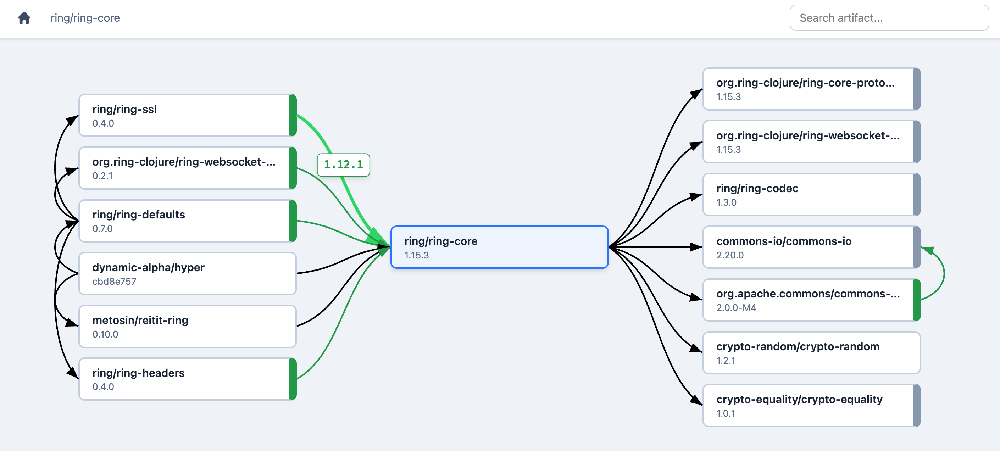

# Dexter — Dependency Explorer

Dexter is an interactive, browser-based tool for visualizing and exploring the artifact dependency graph of JVM projects.

Even trivial projects accumulate dozens—sometimes hundreds—of transitive dependencies, making it impossible to produce a meaningful static graph or to easily diagnose version conflicts buried deep in the tree. Dexter addresses this by letting you navigate the dependency hierarchy interactively: select any artifact to see what depends on it (dependants) and what it depends on (dependencies), with version mismatches highlighted at a glance.



Mousing over a dependency arrow expands it and, for non-exact matches, displays the requested version.

## Features

- **Three-column explorer** — select an artifact to see its dependants (left), the artifact itself (center), and its dependencies (right)
- **Version mismatch detection** — arrows and box borders are color-coded by compatibility: black (exact match), green (compatible), red (incompatible), yellow (unknown/git SHA)
- **Keyboard navigation** — `⌘F`/`Ctrl+F` to search artifacts by name, `⌘H`/`Ctrl+H` to return to the project root
- **Animated transitions** — boxes animate smoothly when navigating; arrows fade out and redraw
- **Dynamic layout** — columns resize automatically to fill the viewport
- **Windowed columns** — large dependency lists are windowed with scroll indicators so the display stays readable

## Supported Build Tools

| Build Tool | Status |
|---|---|
| **tools.deps** (`deps.edn`) | ✅ Supported |
| **Leiningen** (`project.clj`) | ✅ Supported |
| **Maven** (`pom.xml`) | 🔜 Planned |
| **Gradle** (`build.gradle`) | 🔜 Planned |

## Installation

### Homebrew (OS X)

Install with `brew install hlship/brew/dexter`.

### Linux (or manual)

Download Dexter from [GitHub Releases](https://github.com/hlship/dexter/releases)
and unpack the distribution, which includes the `dexter` script, and the JAR file
containing the code.

Copy the two files to a directory on your `$PATH`, _or_, create a symlink
for the `dexter` script in a directory on your `$PATH` (the script will follow 
symlinks to find the JAR).

## Usage


The `dexter` command auto-detects the project type, resolves the full transitive dependency graph, starts a local web server, and opens a browser.

### Options

```
  -p, --port NUMBER   Port for the web server (default: random free port)
  -f, --file PATH     Path to a dependency file (default: current directory)
  -a, --alias NAME    Add a build alias/profile (repeatable)
  --no-open           Don't automatically open a browser
```

### Examples

```bash
# Explore the current project
dexter

# Explore a specific project with dev dependencies included
dexter -f /path/to/project -a dev

# Leiningen project with dev and test profiles
dexter -f /path/to/project.clj -a dev -a test

# Use a specific port, don't open browser
dexter -p 8080 -O
```

## Understanding the Display

### Columns

| Left | Center | Right |
|---|---|---|
| **Dependants** — artifacts that depend on the selected artifact | **Selected** — the artifact being examined | **Dependencies** — artifacts the selected artifact depends on |

Click any artifact to make it the new selection. The display animates to show its dependants and dependencies.

### Arrow Colors

Arrows represent dependency relationships. Their color indicates whether the version requested by the parent matches the version actually resolved:

| Color | Meaning |
|---|---|
| **Black** | Exact match — requested version equals resolved version |
| **Green** | Compatible — same major version (or same major.minor for 0.x) |
| **Red** | Incompatible — different major version |
| **Yellow** | Unknown — involves a git SHA, local path, or unparseable version |

Hover over any arrow to highlight it and see the requested version.

### Box Annotations

- **Wide colored right border** — the artifact has a dependency with a version mismatch (color reflects the worst mismatch)
- **Wide grey right border** — the artifact is a leaf node (no further dependencies)

## Development

### Prerequisites

- Clojure CLI
- [Tailwind CSS CLI](https://tailwindcss.com/blog/standalone-cli) (for CSS rebuilds)
- [Babashka](https://babashka.org/) (for task runner)

### Running in Development

```bash
# Terminal 1: Tailwind CSS watcher
bb tailwind

# Terminal 2: Clojure REPL
clojure -M:dev
```

From the REPL:

```clojure
;; Load a deps.edn project
(require '[net.lewisship.dex.deps-reader :as deps-reader])
(require '[net.lewisship.dex.deps :as deps])
(def db (-> (deps-reader/read-deps "deps.edn" {:aliases [:dev :test]})
            deps/build-db))

;; Start the server
(require '[net.lewisship.dex.service :as service])
(service/start! {:db db})

;; Stop
(service/stop!)
```

### Tests

```bash
bb test
```

## License

Copyright © Howard Lewis Ship

Distributed under the Apache Software License 2.0.
